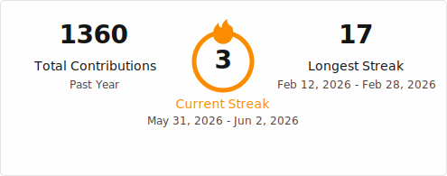

## Hi, I'm Eason

**Mathematics Student | Theoretical Physics | Open-Source Enthusiast**

- **Pronouns**: He/Him/They/Them
- **Fun fact**: Good mathematicians never take anything for granted.

### Basic Info
- I am currently an [Undergraduate Mathematics](https://www.maths.cam.ac.uk/index) student at [St John's Cambridge](https://www.joh.cam.ac.uk), [University of Cambridge](https://www.cam.ac.uk).
- I previously studied at [St Paul's School, London](https://www.stpaulsschool.org.uk) for my A-Levels.
- My current interest lies in **Analysis** and **Theoretical Physics**, but I am passionate about Algebra and Topology, and more generally Natural Sciences and Algorithms in Theoretical Computer Science. I like understanding how the world operates!
- I am also passionate about open-source projects in Computer Science and resources in Mathematics.

### Skills
- **Programming Languages**: C++, C#, Python, SQL
- **Mathematical Languages**: LaTeX, MATLAB, Mathematica
- **Tools**: Git, GitHub, Jupyter Notebook
- **Transferrable Skills**: Problem-Solving, Teamwork, Leadership

### Selection of Current and Past Projects

#### Current Projects
- I am currently working on a set of **Typesetted Notes** for **Undergraduate Mathematics** at University of Cambridge.
- I am also working on a set of solutions to **STEP Questions**. [Source Code](https://github.com/EasonSYC/step-project) and [Deployment](https://step.easonshao.com) are available.

#### Past Projects (Programming)
- **Earthquake Warning Display System** was my A-Level Computer Science Coursework. The [Code Repository](https://github.com/EasonSYC/early-earthquake-and-tsunami-warning-viewer) and [Report](https://github.com/EasonSYC/a-level-computing-coursework) are available.
- Collaboration project with [`@stroomboli`](https://github.com/strombooli) for a [**COVID-19 Screening Register**](https://github.com/EasonSYC/covid-19-screening-register), which was actually deployed and used in at least two neighbourhoods, used by at least 100 people in the community in Shanghai.

#### Past Projects (Mathematics)
- A [**LaTeX Style** of my own](https://github.com/EasonSYC/latex-style).
- Presentations on [**Calculus without Limits** (Non-Standard Analysis)](https://github.com/EasonSYC/calculus-without-limits) (Finalist in Toller Prize for Mathematical Presentations) and [Physical Quantities and Units](https://github.com/EasonSYC/physical-quantities-and-units) back at St Paul's School.
- I have taken part in **Mathematical Modelling Competitions** back in Shanghai, and lead the team including [`@MathxStudio`](https://github.com/MathxStudio), [`@LyraaaXY`](https://github.com/LyraaaXY), and [`@xrh_0232b7ab`](https://github.com/xrh-0232b7ab). We **represented China Mainland in the [IMMC Competition](https://www.immchallenge.org)** in 2022.
  - The paper can be found [here](https://github.com/stOOrz-Science-Mind/IMMC_2022_GC_International).
  - A [presentation](https://github.com/stOOrz-Science-Mind/IMMC_2022_GC_International_Presentation) is also available.
  - Other highlights include [Smart Lamppost Deployment](https://github.com/stOOrz-Science-Mind/IMMC_2022_GC_Autumn) and [Modelling Metaverse](https://github.com/stOOrz-Science-Mind/IMMC_2022_GC_Winter).
  - A complete list of work can be found at [`@stOOrz-Science-Mind`](https://github.com/stOOrz-Science-Mind).
- I lead the St Paul's School Team at [Princeton University Mathematical Challenge 2024, Power Round](https://jason-shi-f9dm.squarespace.com/archives#2024), coming top of all non-US teams. [Our submission](https://github.com/EasonSYC/pumac-2024) is available.
- I am a co-founder of the Physics Problem-Solving Society at St Paul's School. Resources we used to prepare for the sessions are [available here](https://github.com/EasonSYC/physics-problem-solving).
- A set of [Mock Interview Questions](https://github.com/EasonSYC/interview-questions).
- A set of [Revision Questions for Calculus](https://github.com/EasonSYC/calculus-revision-questions), in collaboration with Aidan Wong back at St Paul's School.

### Contacts
- **Email**: [`ys734@cam.ac.uk`](mailto:ys734@cam.ac.uk), [`eason.syc@icloud.com`](mailto:eason.syc@icloud.com)
- **Cambridge Lookup Profile**: [Cambridge Lookup](https://lookup.cam.ac.uk/person/crsid/ys734)
- **Website** (under development): [`easonshao.com`](https://easonshao.com) and [`yichengshao.com`](https://yichengshao.com)
- **GitHub**: [`@EasonSYC`](https://github.com/EasonSYC/)
- **LinkedIn**: [Yicheng Shao](https://www.linkedin.com/in/yicheng-shao/)

### GitHub status

